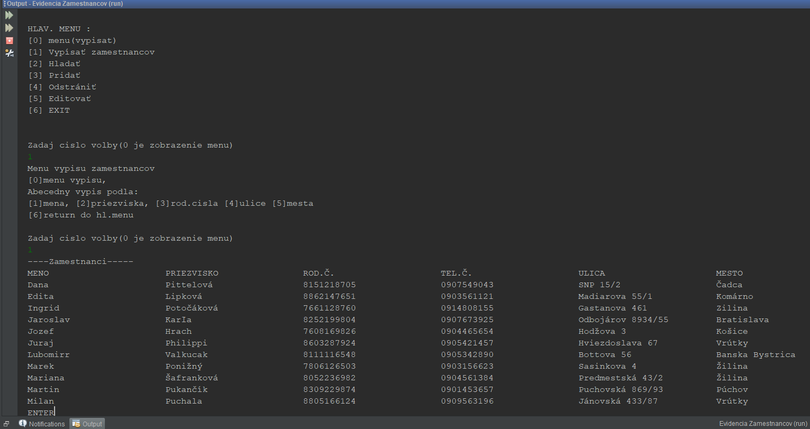

## **ABOUT**

Aplikácia slúži na evidenciu zamestnancov. Obsahuje 22 zamestnancov a každý z nich má svoje: meno, priezvisko, rodné číslo, telefónne číslo, mesto, v ktorom býva, ulicu a pracovnú pozíciu. Zamestnanci sa dajú abecedne vypísať, jednotlivo vyhľadať, pridať alebo odstrániť. V aplikácii sa nachádza možnosť editácie, ktorá zmení ich vybranú kategóriu.
   

(Údaje sú vymyslené)
